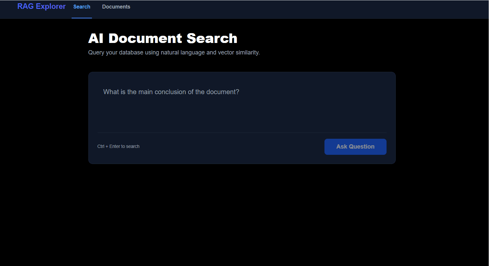
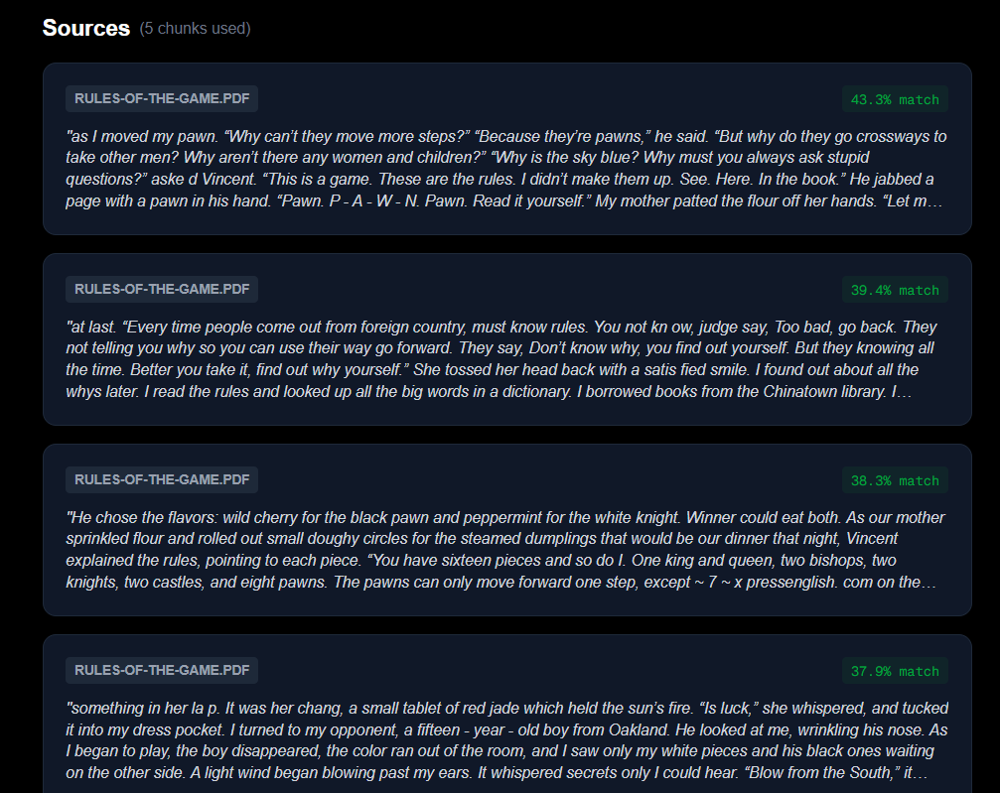
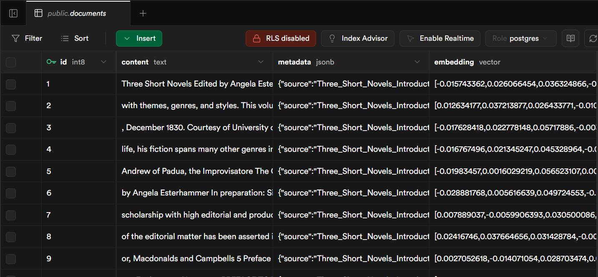

# 🔍 AI Document Search (RAG Explorer)

A full-stack **Retrieval-Augmented Generation (RAG)** application built with Next.js. This platform allows users to upload PDF documents, index them into a high-performance vector database, and query that data using natural language.

---

<div align="center">
  
  <p><i>Real-time vector search and AI answer generation with smooth skeleton loading states.</i></p>
</div>

---

## 🚀 Technical Stack

- **Framework**: [Next.js 15+](https://nextjs.org/) (App Router)
- **AI Models**: OpenAI `gpt-4o-mini` (Generation) and `text-embedding-3-small` (Embeddings)
- **Database**: [Supabase](https://supabase.com/) with `pgvector` for vector similarity search
- **Styling**: Tailwind CSS
- **Content Rendering**: `react-markdown` for rich text AI responses

## ✨ Key Features

- **Intelligent PDF Processing**: Automated text extraction and recursive character chunking (1000 chars / 200 overlap) to maintain semantic context.
- **Vector Similarity Search**: Uses cosine distance to find the most relevant document segments based on intent, not just keywords.
- **Transparent Citations**: Displays specific source chunks used for every answer, including similarity match percentages to build user trust.
- **Modern UI**: Features skeleton loaders for "analyzing" states and a fully responsive design.

## 🌟 Result Showcase

### Accuracy in Action

When asked complex questions about a specific document, the system retrieves the exact paragraph needed to ground the AI's response:

<div align="center">
  
</div>

- **Semantic Understanding**: The system correctly identifies topics like "pawn movements" even when the user query uses different phrasing.
- **Verified Answers**: Every AI response is backed by a "Match %" score retrieved directly from the Supabase vector engine.

## 🧠 Technical Challenges & Solutions

### 1. Hallucination Control

**Challenge**: LLMs often "hallucinate" or guess information when relevant data is missing from the provided context.
**Solution**: Refined system prompts to strictly enforce "context-only" answering and implemented a 0.5 similarity threshold in the Supabase RPC call to filter out noise.

### 2. Context Window Management

**Challenge**: Full PDFs contain too many tokens to send to the AI in a single prompt.
**Solution**: Used **Recursive Character Chunking** to break data into manageable segments while preserving semantic meaning across boundaries via a 20% chunk overlap.

### 3. Vector Data Architecture

**Challenge**: Storing and searching millions of dimensions efficiently.
**Solution**: Leveraged Supabase `pgvector` to store 1536-dimensional embeddings, enabling millisecond retrieval times for document context.

<div align="center">
  
  <p><i>Vector embeddings stored as high-dimensional arrays in Supabase for mathematical similarity matching.</i></p>
</div>

## 🛠️ Installation & Setup

1.  **Clone the repository**:
    ```bash
    git clone [https://github.com/isuar/RAG-Explorer.git](https://github.com/isuar/RAG-Explorer.git)
    ```
2.  **Install dependencies**:
    ```bash
    npm install
    ```
3.  **Environment Variables**:
    Create a `.env.local` file with your API keys:
    ```env
    NEXT_PUBLIC_SUPABASE_URL=your_supabase_url
    NEXT_PUBLIC_SUPABASE_ANON_KEY=your_anon_key
    OPENAI_API_KEY=your_openai_api_key
    ```
4.  **Database Configuration**:
    Run the following SQL in your Supabase SQL Editor to enable the similarity search function:

```sql
-- Create the match_documents function for vector search
create or replace function match_documents (
  query_embedding vector(1536),
  match_threshold float,
  match_count int
)
returns table (
  id bigint,
  content text,
  metadata jsonb,
  similarity float
)
language plpgsql
as $$
begin
  return query
  select
    documents.id,
    documents.content,
    documents.metadata,
    1 - (documents.embedding <=> query_embedding) as similarity
  from documents
  where 1 - (documents.embedding <=> query_embedding) > match_threshold
  order by similarity desc
  limit match_count;
end;
$$;
```
